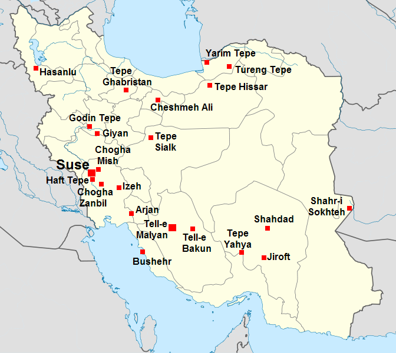
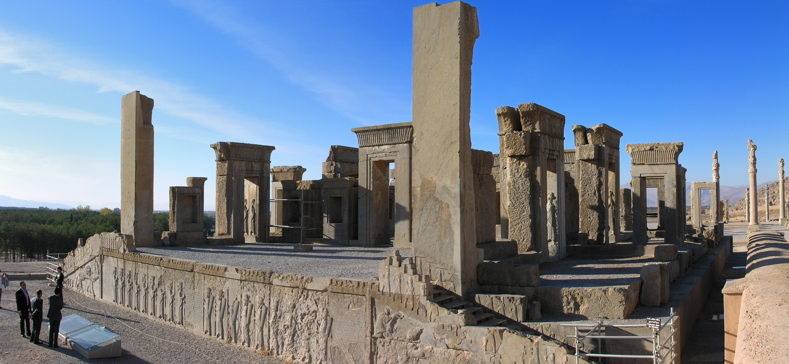
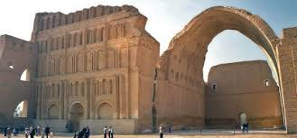
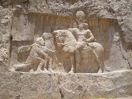
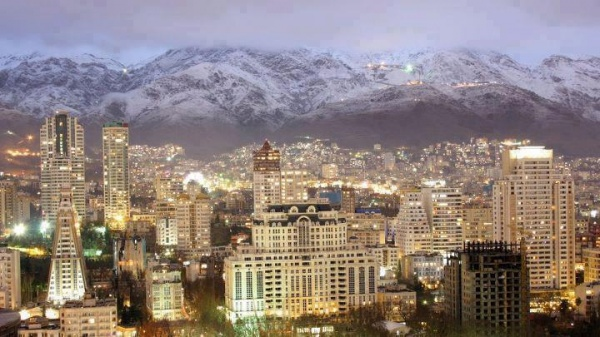
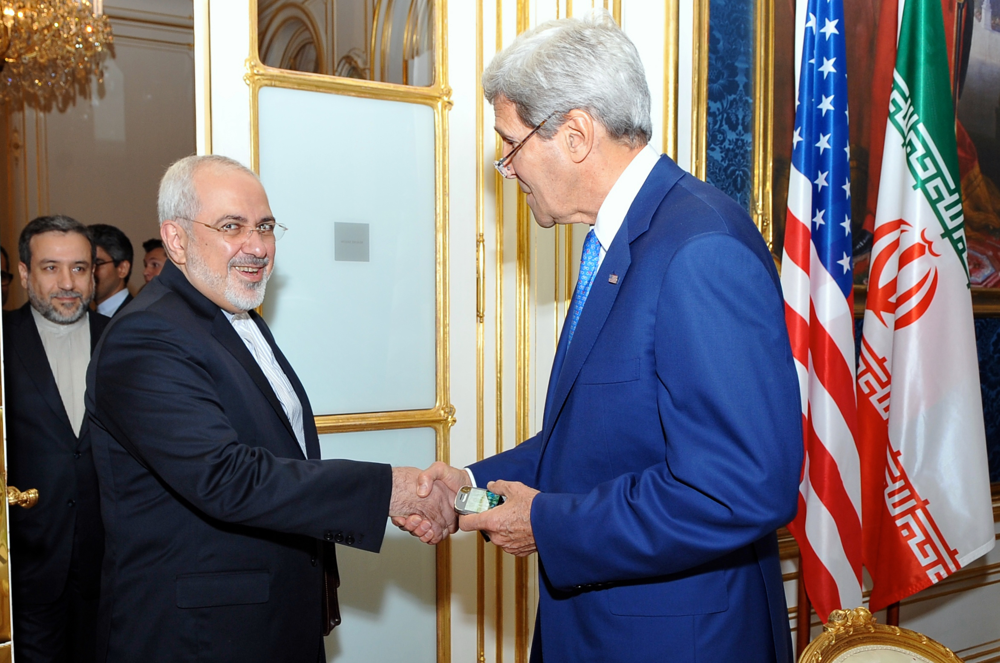
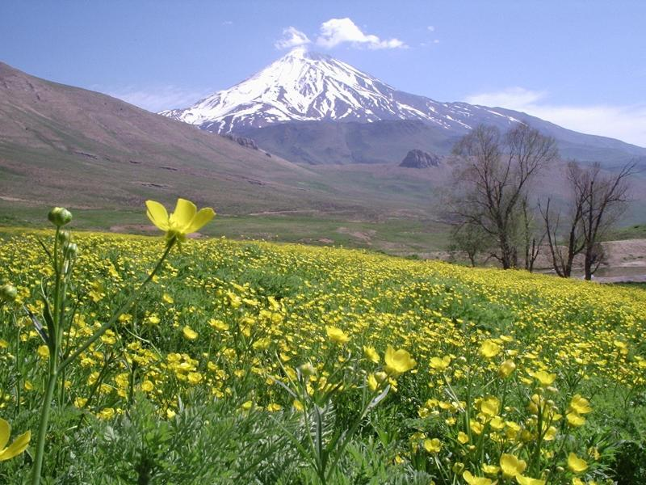
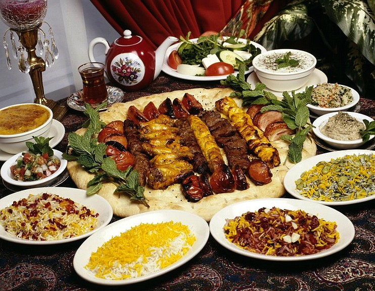

% An Extremely General Introduction to Iran
% Sepideh Saeedi
% July 31 2017

# Iran ایران
* Population: 80.28 million
* Capital : Tehran 

<aside class="notes">
Iran also formerly known as Persia is located in Western Asia.
</aside>

# Prehistoric civilizations

<aside class="notes">
Iran is home to one of the world's oldest civilizations, beginning with permenant settlements and villages from the tenth millenium BCE and also the beginning of cities and formation of first states during the fourth millennium BCE. 
</aside>

# Achaemenid Empire

<aside class="notes">
The Persian Empire reached its greatest extent during the Achaemenid period founded by Cyrus the Great in the sixth century BC, stretching from Eastern Europe to the Indus Valley, becoming a larger empire than previously ever existed in the world.
</aside>

# Antiquty Empires

<aside class="notes">
The Iranian realm fell to Alexander the Great in the fourth century BCE, but reemerged shortly after as the Parthian Empire, followed by the Sasanian Empire, which became a leading world power for the next four centuries.
</aside>

# Islamic Era

<aside class="notes">
Arab Muslims conquered Iran in the seventh century AD, ultimately leading to the displacement of the indigenous faith of Zoroastrianism  with Islam. Unlike many other civilizations that changed their language to Arabic through accepting Islam, the Persian language never changed in Iran. Iran made major contributions to the Islamic Golden Age that followed, producing many influential figures in art and science.
</aside>

# The Modern Iran

# Have you ever wondered
where the animosity between the American and Iranian government come from?

<aside class="notes">
Although if you ever travel to Iran you will be very surprised to see how people especially the young people are obssessed with the American pop culture.
</aside>

# 1953 Coup

<aside class="notes">
To gain a perspective let's go back in time.In 1953 a CIA staged coup overthrew the democratically elected government of Dr.Mosaddegh to bring back a corrupt king and leave the oil industry under the influence of Western corporations.
</aside>

# 1979 Revolution

<aside class="notes">
 Growing dissent against foreign influence and political repression led to the 1979 Revolution, which followed the establishment of the currrent Islamic Republic. This fundamental change had numerous consequences that affected peopl's lives.
</aside>

## Peace not War 

<aside class="notes">
Despite all these  the Iranian government's  and people's goal is to establish a new world order based on world *peace*
</aside>

# Geography

<aside class="notes">
Iran has a very diverese geography. You can ski in the Zagros mountains (in fact some of the best ski fields in the world are in Iran) and then drive two hours to the shores of the Persian gulf and swim uder the sunshine.
</aside>

# Persian Cheetah

<aside class="notes">
The wildlife of Iran is composed of several animal species the most famous one and my favorite is the Persian Cheetah.
</aside>

# Cuisine 

<aside class="notes">
Due to its variety of ethnic groups , the cuisine of Iran is diverse. Herbs are frequently used, along with fruits such as plums, pomegranate, quince, prunes, apricots, and raisins. To achieve a balanced taste, characteristic flavorings such as saffron, dried lime, cinnamon, and parsley are mixed delicately and used in various dishes.
</aside>

# Sports

<aside class="notes">
 Soccer is the most popular sport in Iran, with men's national team having won the Asian Cup on three occasions.
</aside>

# Thank you!
Hope to see you in Tehran one day!